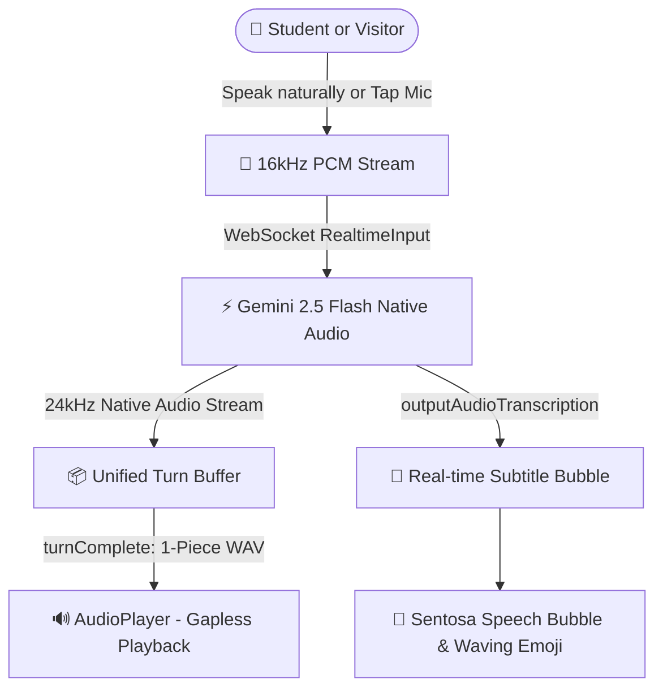

<div align="center">

# 🤖 SENTOSA ✨
### *Your Friendly AI School Concierge & Campus Companion*

[](https://flutter.dev)
[](https://ai.google.dev)
[](https://flutter.dev/multi-platform)
[](https://sentosa.edu)
[](https://flutter.dev)

<br/>

> **"Hello! I'm Sentosa, your school guide. Ask me anything about classes, rooms, or events!"**  

<br/>

</div>

---

## 🎈 What is Sentosa?

**Sentosa** is an adorable, ultra-responsive, interactive AI kiosk assistant crafted for **Schools**. 

Designed specifically for school lobbies, reception touchscreens, and student discovery hubs, Sentosa combines a **warm robotic personality**, **expressive animated eyes**, and **real-time conversational voice** to greet students, guide visiting parents, and answer campus questions in both **English** and **Malayalam (മലയാളം)**!

---

## 🌟 Magical Features

### 👀 1. Expressive Robotic Visor
- **Lifelike Eye Physics:** Sentosa blinks, squints inquisitively, nods enthusiastically, and roams around when idle!
- **Interactive Gaze Tracking:** Follows your pointer or finger across the kiosk screen with fluid, damped micro-motions.
- **Tickle & Tap Reactions:** Tap Sentosa’s visor or speech bubble to see cute surprise nods and playful eye winks!

### 🎙️ 2. Real-Time Gemini Live Native Audio
- **Instant Conversations:** Powered by Google's `gemini-2.5-flash-native-audio-latest` streaming bidirectional WebSocket protocol.
- **Zero-Stutter Seamless Speech:** Custom unified PCM-to-WAV packaging ensures crystal-clear, continuous, and gapless voice playback without awkward mid-sentence breaks.
- **Acoustic Echo Guard:** Automatically locks the microphone during Sentosa's speech and grace periods to prevent echo in noisy hallways.

### 🗣️ 3. Bilingual Superpowers (English & മലയാളം)
- **Natural Language Mirroring:** Speak in English or Malayalam, and Sentosa replies in that same language fluently and politely.
- **Conversational Manglish:** Effortlessly understands and answers queries like *"Admission office evideyanu?"* or *"School timings enthanu?"*.

### 💬 4. Kid-Friendly Live Subtitle Bubble
- **Spoken Subtitles:** Shows real-time speech subtitles right below the robot face so young readers and visitors can read along as Sentosa speaks.
- **Zero Internal Jargon:** Automatically filters out model reasoning thoughts—kids only see what Sentosa says, never internal computer notes!

### 🗺️ 5. Campus Quick Actions
Oversized, cheerful touch cards for young learners and busy parents:
- 📚 **Library & Study Pods** (1st Floor)
- 🏫 **Principal's Office** (Dr. Elena Vance • Admin Wing)
- 🍎 **Cafeteria & Dining** (South Wing meal timings)
- 🕒 **School Hours** (8:00 AM – 3:30 PM, Mon–Fri)
- 🎓 **Admissions Office** (Eligibility, document checklist & application guide)

---

## 🧩 How Sentosa Works (Architecture)



---

## 🚀 Getting Started

### 📋 Prerequisites
- [Flutter SDK (3.x or newer)](https://flutter.dev/docs/get-started/install)
- Windows 10/11 with Visual Studio C++ desktop development tools
- Google Gemini API Key with access to the Gemini Multimodal Live API

### 💻 Setup & Installation

1. **Clone the Repository:**
   ```bash
   git clone https://github.com/your-org/sentosa.git
   cd sentosa
   ```

2. **Install Flutter Dependencies:**
   ```bash
   flutter pub get
   ```

3. **Run on Windows Desktop / Kiosk Mode:**
   ```bash
   flutter run -d windows --dart-define=GEMINI_API_KEY="YOUR_GEMINI_API_KEY_HERE"
   ```

4. **Build Production Release Executable:**
   ```bash
   flutter build windows --dart-define=GEMINI_API_KEY="YOUR_GEMINI_API_KEY_HERE"
   ```
   The portable executable will be generated at:
   `build/windows/x64/runner/Release/sentosa.exe`

---

## 🎮 Kiosk Shortcuts & Controls

| Command | Action |
|---|---|
| **Tap Microphone** | Start or stop voice conversation |
| **Tap Robot Face / Bubble** | Trigger cute squint, double-blink & greet cycle |
| **Say "Sentosa"** | Hands-free wake word activation |
| **Tap Quick Action Card** | Quick campus directions or admission assistance |
| **Back Arrow Icon** | Return smoothly to campus discovery menu |

---

## 🏫 About Sentosa International Academy

- **Location:** Ground Floor Reception Kiosk & Lobby
- **Principal:** Dr. Elena Vance
- **Timings:** Monday – Friday, 8:00 AM – 3:30 PM
- **Grades:** Pre-Kindergarten through Grade 12
- **Admissions Office:** Ground Floor, Admin Wing (Mr. Arthur Pendleton)

---

<div align="center">

Licensed by **Techosa Robotics**

</div>
